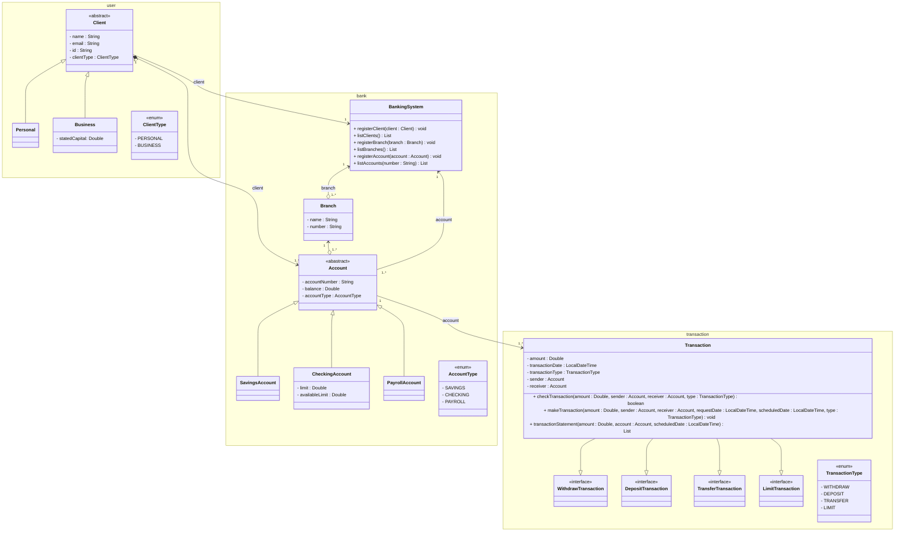

# Desafio 1 - Aplicação bancária
Repositorio criado para entrega do desafio proposto, fazendo parte do nivelamento de conhecimento de Java.

### Solicitação ###
Faça uma aplicação bancária que permita transferências de valores. O sistema deve conter as seguintes funcionalidades (mínimas):

- Cadastro de conta bancária
- Numero da conta, numero agencia, cliente, saldo, limite, tipo da conta
- Depósito
- Retirada (saque)
- Alteração de limite
- Transferências
- Pensem em limitar o valor de acordo com o horário;
- Exportação de histórico de transações (CSV).

A aplicação deve conter um menu via terminal para seleção da operação desejada.

### Considerações: ###
- Perceba que a descrição do sistema foi feita de forma genérica, propositalmente para encorajar a extensão de funcionalidades de acordo com a sua necessidade.
- As funcionalidades descritas acima são básicas e mandatórias para o funcionamento e aceite da entrega.
- Utilize o máximo de conceitos abordados durante o curso. Ex: menus com Scanner, boas práticas de nomenclatura, herança, listas, interfaces, trabalho com arquivos, etc.
- Não há necessidade de persistência em bancos de dados. Pensem numa estrutura utilizando listas/mapas em memória para armazenamento.
- Os relacionamentos entre as classes (entidades do sistema) ficam ao seu critério. Utilizem quantas classes e atributos julgarem necessário para a modelagem.
- Sigam o princípio: baixo acoplamento, alta coesão.
- Para estruturar seu código, imagine a aplicação como um entregável que possa ser evoluído sem a necessidade de grande refatoração. Ex: não tenho um banco de dados hoje ou uma API Rest para acesso às operações, mas posso construir um módulo sem afetar O DOMÍNIO do sistema (classes de negócio e entidades).
- Pensem que toda operação repetitiva pode ter sua própria classe ou método, como apresentação das informações na tela (ou input), que pode ter dados como parâmetros.

### Requisitos: ###
- O projeto deve estar em repositório público no GitHub.
- O projeto deve conter um README.md com instruções de execução e operação da aplicação.
- Desenhe um diagrama de classes e um de sequência para explicar o funcionamento do sistema. O mesmo deve estar na página explicativa (README) do projeto.
- Sugestão: utilizem MermaidJS: https://github.com/mermaid-js/mermaid/blob/develop/README.md

### Diagrama de classe: ###
